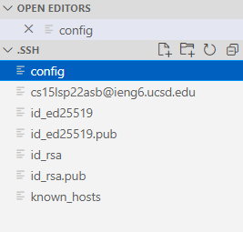
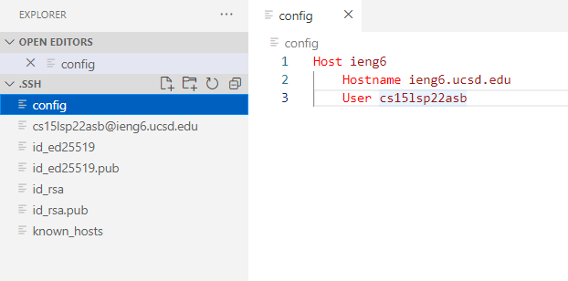
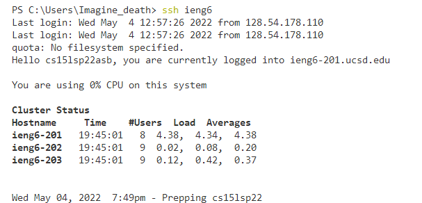
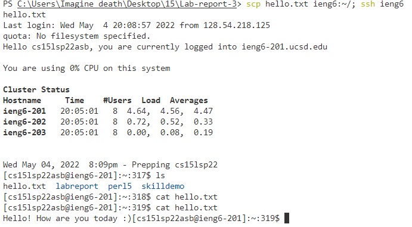

# Streamline Congiguration, Gtihub Access ieng6, and Copying Whole Directories

## Streamlining `ssh` Configuration

### Introducation

Let's start with streamlining with ssh configuration. 
This is a tool that helps to simplify your login by input all the information
that you need for logging into your remote computer into the configure file 
and simply type `ssh (Hostname)` to login.

### Creating Config file in .ssh

#### Step 1
* Begin with creating a config file in your **local computer** `.ssh` folder. 
By doing so, you need to make sure that your current file location is in `C:\Users\(Username)`. 
If you are not in this location just do `cd..` until it only have the location I mentioned.

#### Step 2
* After you have done step 1, you should have similiar file location in the 
picture below. Then we need to go to our `.ssh` file by doing `cd .ssh` in our terminal.

#### Step 3

* After you are in the .ssh, you open it in vscode by hover your cursor to the file address, 
click on it, it should have something called `open file in new window`,
click on it and it will forward to the .ssh file directly.

#### Step 4

* You should in your .ssh file right now like the picture below.
Now, create the a new file and name it as config.

#### Step 5

* After your created the `config` in your .ssh file, click on it, and copy
the following code below into your config.

        Host ieng6
            Hostname ieng6.ucsd.edu
            User cs15lsp22zzz (the 3 unique letters)

* So you should have something like the image below in your config file after
copy the code above.

#### Step 6

* Now you have finished setting up the configure, type `ssh ieng6` in
your terminal, it should do the same thing as doing `ssh cs15lsp22zzz@ieng6.ucsd.edu`

## Other way to use ssh configuration

Now we have a very simplified command for logging into our remote computer,
let's try upload a file by using our what we learned above.

* In case you don't remeber the command for upload file to remote computer
it is `scp <filename> <15L email address>:~/`.

    * But right now, we have much simplier code for `15L email address`, so
    in this case, we don't need to type out the long email to avoid typo.
    We just need to do `scp <filename> ieng6:~/` as the replacement of the command
    above.

    

    * As you see the image above, I have uploaded the file and also log into
    my remote computer, and check it if is the same file as I have on local.
    It turns out, I do have the same one and it is a successful upload with
    less time complexity.

## Setup Github Access from ieng6

Hello

## Copy whole directories with `scp -r`

### Step 1

*   Assuming that you are in your directory file where you have all 

