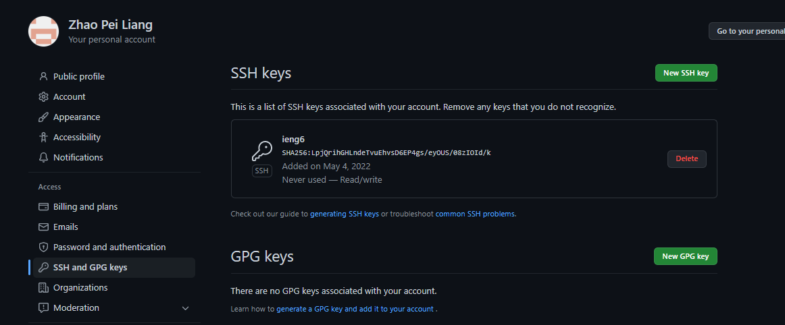

# Streamline Congiguration, Gtihub Access ieng6, and Copying Whole Directories

## Streamlining `ssh` Configuration

### Introducation

Let's start with streamlining with ssh configuration. 
This is a tool that helps to simplify your login by input all the information
that you need for logging into your remote computer into the configure file 
and simply type `ssh (Hostname)` to login.

### Creating Config file in .ssh

#### Step 1
* Begin with creating a config file in your **local computer** `.ssh` folder. 
By doing so, you need to make sure that your current file location is in `C:\Users\(Username)`. 
If you are not in this location just do `cd..` until it only have the location I mentioned.

#### Step 2
* After you have done step 1, you should have similiar file location in the 
picture below. Then we need to go to our `.ssh` file by doing `cd .ssh` in our terminal.

#### Step 3

* After you are in the .ssh, you open it in vscode by hover your cursor to the file address, 
click on it, it should have something called `open file in new window`,
click on it and it will forward to the .ssh file directly.

#### Step 4

* You should in your .ssh file right now like the picture below.
Now, create the a new file and name it as config.

#### Step 5

* After your created the `config` in your .ssh file, click on it, and copy
the following code below into your config.

        Host ieng6
            Hostname ieng6.ucsd.edu
            User cs15lsp22zzz (the 3 unique letters)

* So you should have something like the image below in your config file after
copy the code above.

#### Step 6

* Now you have finished setting up the configure, type `ssh ieng6` in
your terminal, it should do the same thing as doing `ssh cs15lsp22zzz@ieng6.ucsd.edu`

## Other way to use ssh configuration

Now we have a very simplified command for logging into our remote computer,
let's try upload a file by using our what we learned above.

* In case you don't remeber the command for upload file to remote computer
it is `scp <filename> <15L email address>:~/`.

    * But right now, we have much simplier code for `15L email address`, so
    in this case, we don't need to type out the long email to avoid typo.
    We just need to do `scp <filename> ieng6:~/` as the replacement of the command
    above.

    

    * As you see the image above, I have uploaded the file and also log into
    my remote computer, and check it if is the same file as I have on local.
    It turns out, I do have the same one and it is a successful upload with
    less time complexity.

## Setup Github Access from ieng6

### Step 1

* First of all, we need to create a keygen for github

    * refer to [this blod](https://strawberryakai.github.io/cse15l-lab2-reports/lab-report-1-week-2.html#introduction)
    for how to create keygen, (replace id_rsa to id_rsa_github)

* After create the keygen for github, we need to go to our local `.ssh` folder,
 copy the key code for futher usage.

 

 * Then go to [github](https://www.github.com), login, click on your icon 
 click settings, click **SSH and GPG Keys**  click **Add SSH Keys**,
  and paste the keygen 

## Copy whole directories with `scp -r`

### Step 1

*   Assuming that you are in the folder where you have all the java files
are stored. Exist that by doing `cd..` (if you are a window user) where you
only see the folder name instead of your files name when you do `ls`.

### Step 2

* Then upload the folder recursively by doing `scp -r (foldername) ieng6:~/`
to upload to our remote computer.

### Running a git commands to commit

After you done all that, you can go back to your IDE, in your terminal login
to your `ieng6` run, try change something in java file and do `git commit -a`
it should ask you to input a comment for the commit and after this press `enter` to
proceed the process.

[Link to the commit](https://github.com/StrawberryAkai/Lab-Report-3/commit/8cbfece173f1da56a62906f75fe48ff91d7c1191)

### Running a test

* After finished uploading the files into your remote computer, login by doing
`ssh ieng6` then do `ls` after login, you should see the folder that we just
uploaded.

    * I uploaded my MardownParse folder as an example.

* So as you see the image above, the folder that highlighted with green is
the folder that we just uploaded.

* `cd` to that folder and run the makefile test by doing `make test`

### Running above steps within one line

We can actually run above command lines within one line to save a bunch time
by doing `scp -r (foldername) ieng6:~/; ssh ieng6 "cd newParse; make test"`
as a combination of the above steps.

Above images are showing the whole process of the combination commands.
